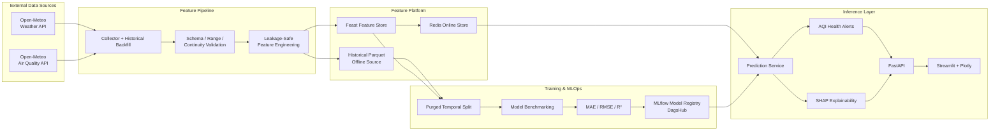
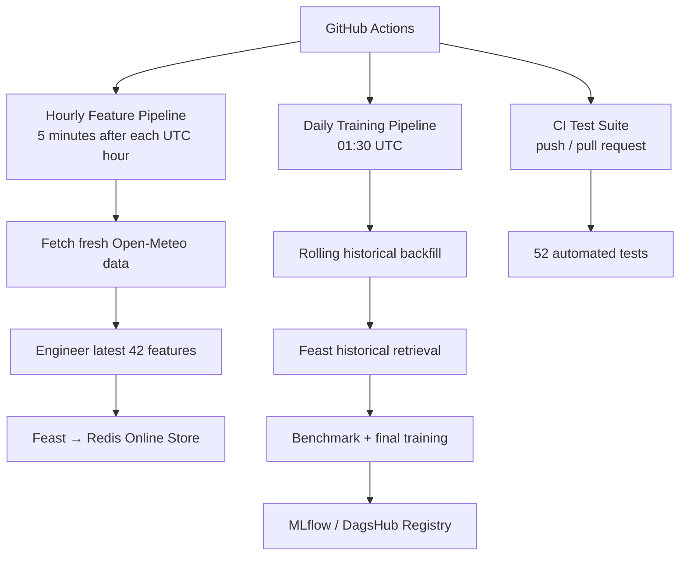
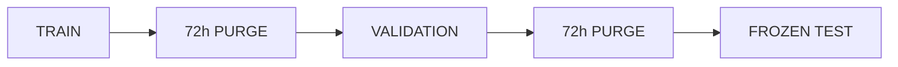
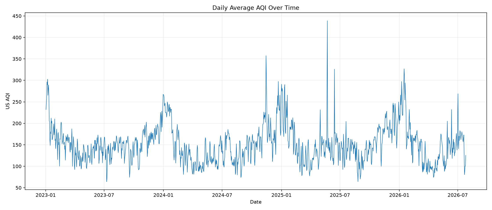
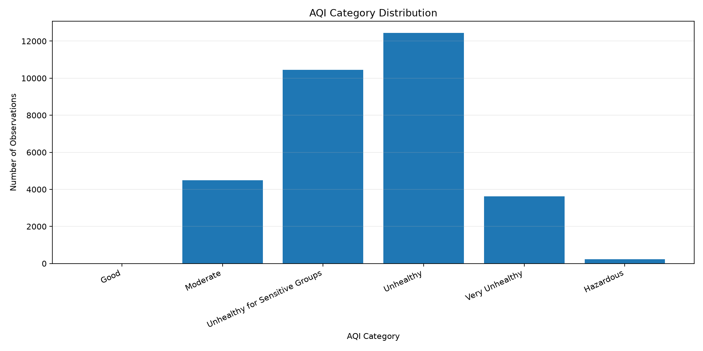
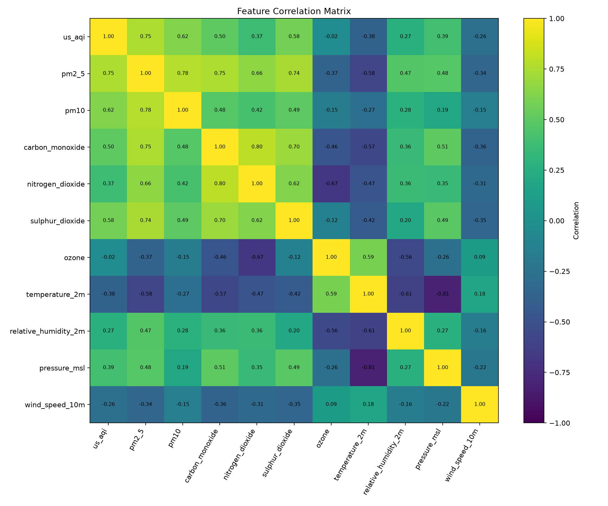
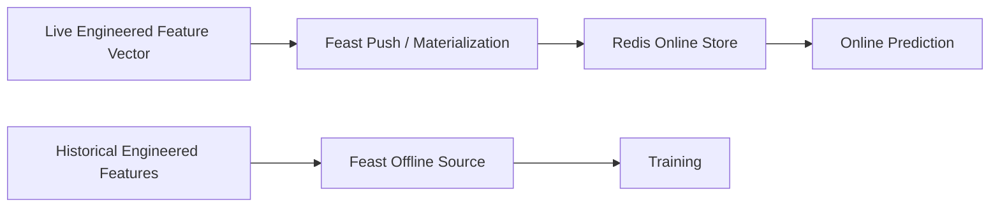
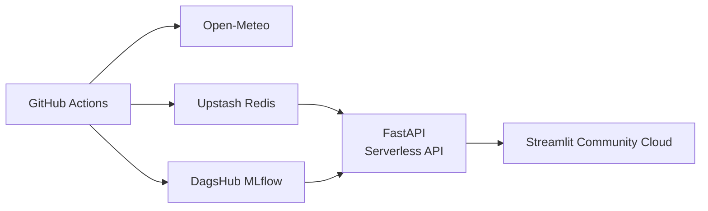

<div align="center">

# 🌍 Pearls AQI Predictor

### Production-Grade, Explainable 3-Day Air Quality Forecasting with Automated MLOps

**Forecasting Lahore's U.S. AQI at +24h, +48h, and +72h using live weather + pollution signals, leakage-safe feature engineering, a Feast feature store, MLflow model registry, automated retraining, FastAPI serving, and a Streamlit intelligence dashboard.**

[](https://github.com/Talha-Techie/Pearls-AQI-Predictor/actions/workflows/tests.yml)
[](https://github.com/Talha-Techie/Pearls-AQI-Predictor/actions/workflows/feature_pipeline.yml)
[](https://github.com/Talha-Techie/Pearls-AQI-Predictor/actions/workflows/training_pipeline.yml)


[Repository](https://github.com/Talha-Techie/Pearls-AQI-Predictor) ·
[GitHub Actions](https://github.com/Talha-Techie/Pearls-AQI-Predictor/actions) ·
[Model Metrics](reports/model_benchmarks/final_test_metrics.csv) ·
[EDA](reports/figures)

</div>

---

## Executive Summary

**Pearls AQI Predictor** is an end-to-end machine learning system that predicts **U.S. Air Quality Index (AQI) for the next 24, 48, and 72 hours** for Lahore, Pakistan.

The project goes beyond a notebook-based forecasting model. It implements the full production ML lifecycle:

- automated weather and air-quality ingestion from **Open-Meteo**,
- strict schema and hourly continuity validation,
- **42 leakage-safe model features**,
- historical backfilling and target generation,
- a **Feast Feature Store** with Redis-backed online serving,
- persistence, linear, ensemble, statistical, and deep-learning benchmarks,
- leakage-safe **purged temporal validation**,
- final model evaluation with **MAE, RMSE, and R²**,
- **MLflow Model Registry** hosted through DagsHub,
- **SHAP** forecast explanations,
- health categories and hazardous-AQI alerts,
- a versioned **FastAPI** prediction service,
- an interactive **Streamlit + Plotly** dashboard,
- hourly feature updates and daily training through **GitHub Actions**,
- automated tests on every push and pull request.

The result is a reproducible MLOps system designed around a clean separation between **data collection, feature engineering, feature storage, model training, registry, inference, explanation, API serving, and visualization**.

---

## Why This Project Is Different

Many forecasting projects stop after obtaining an accuracy score. This project treats forecasting as an **operational ML system**.

| Area | Implementation |
|---|---|
| Forecast horizons | Direct +24h, +48h, +72h AQI prediction |
| Data ingestion | Open-Meteo Weather + Air Quality APIs |
| Historical pipeline | Chunked API backfill with retry/backoff |
| Validation | Schema, nulls, duplicates, ranges, hourly continuity |
| Feature engineering | 42 weather, pollution, temporal, lag, rolling, cyclical and trend features |
| Leakage prevention | Shifted rolling windows + purged temporal split |
| Feature Store | Feast offline/online architecture |
| Online store | Redis-compatible persistent store |
| Model families | Persistence, Ridge, Random Forest, Gradient Boosting, OLS, PyTorch MLP |
| Evaluation | MAE, RMSE, R² + persistence baseline |
| Registry | DagsHub-hosted MLflow Model Registry |
| Explainability | SHAP LinearExplainer |
| Alerts | AQI categories, health guidance, hazardous forecast detection |
| Serving | FastAPI |
| Dashboard | Streamlit + Plotly |
| Automation | Hourly feature updates + daily model training |
| CI | 52 automated tests |
| Deployment architecture | Serverless-first / managed-cloud design |

---

# System Architecture



### Automation Layer



---

# Project Requirements Coverage

| Requirement | Status | Implementation |
|---|:---:|---|
| Predict AQI for the next 3 days | ✅ | Direct 24h, 48h and 72h targets |
| Weather + pollutant data collection | ✅ | Open-Meteo APIs |
| Time and derived features | ✅ | Local calendar, cyclical, lags, rolling statistics |
| AQI change rate | ✅ | `aqi_change_rate_1h` |
| Feature Store | ✅ | Feast |
| Historical backfill | ✅ | Month-chunked API backfill |
| Historical feature/target retrieval | ✅ | Feast historical feature retrieval |
| Model training pipeline | ✅ | Benchmark + champion finalization |
| MAE / RMSE / R² | ✅ | Validation and frozen test reports |
| Model Registry | ✅ | MLflow registry on DagsHub |
| Hourly automation | ✅ | GitHub Actions Feature Pipeline |
| Daily training automation | ✅ | GitHub Actions Training Pipeline |
| Statistical → deep-learning model variety | ✅ | OLS through PyTorch MLP |
| Explainability | ✅ | SHAP |
| Hazardous AQI alerting | ✅ | Health categories + alert levels |
| FastAPI inference layer | ✅ | `/api/v1/*` |
| Interactive dashboard | ✅ | Streamlit + Plotly |
| Automated testing | ✅ | 52 tests |
| Public cloud deployment | 🟡 | Deployment packaging/finalization in progress |

> The complete ML/MLOps pipeline, feature automation, training automation, API, dashboard, model registry integration, and test suite are implemented. Public application hosting is the remaining deployment step.

---

# Data

## Target Location

| Setting | Value |
|---|---|
| City | Lahore |
| Latitude | `31.5204` |
| Longitude | `74.3587` |
| Local timezone | `Asia/Karachi` |
| Canonical storage timezone | UTC |
| AQI definition | U.S. AQI |

The system stores timestamps in UTC for consistency while generating human/calendar features using Lahore local time.

## Data Sources

The project uses two Open-Meteo services:

- [Open-Meteo Weather API](https://open-meteo.com/)
- [Open-Meteo Air Quality API](https://open-meteo.com/en/docs/air-quality-api)

### Weather Inputs

- Temperature at 2 m
- Relative humidity at 2 m
- Mean sea-level pressure
- Precipitation
- Wind speed at 10 m
- Wind direction at 10 m

### Air Quality Inputs

- U.S. AQI
- PM2.5
- PM10
- Carbon monoxide (CO)
- Nitrogen dioxide (NO₂)
- Sulphur dioxide (SO₂)
- Ozone (O₃)

---

# Historical Dataset

The initial research/training backfill covered approximately:

```text
2023-01-01 → 2026-07-29
```

with:

```text
Raw hourly observations:       31,344
Engineered training rows:      31,248
Model features:                    42
Forecast targets:                    3
```

Daily automated retraining uses a **rolling one-year window** instead of repeatedly downloading the entire multi-year history. This reduces external API load, improves runtime reliability, and keeps the production model focused on recent seasonal conditions.

---

# Feature Engineering

The model uses **42 features**, deliberately separating present conditions from historical information.

## Feature Families

### 1. Current Weather

```text
temperature_2m
relative_humidity_2m
precipitation
pressure_msl
wind_speed_10m
```

### 2. Circular Wind Encoding

```text
wind_direction_sin
wind_direction_cos
```

Circular encoding prevents the artificial discontinuity between directions such as `359°` and `0°`.

### 3. Current Pollution

```text
pm10
pm2_5
carbon_monoxide
nitrogen_dioxide
sulphur_dioxide
ozone
us_aqi
```

### 4. Calendar + Cyclical Time

```text
hour
day_of_week
month
is_weekend

hour_sin
hour_cos
day_of_week_sin
day_of_week_cos
month_sin
month_cos
```

### 5. AQI Lag Features

```text
aqi_lag_1h
aqi_lag_3h
aqi_lag_6h
aqi_lag_12h
aqi_lag_24h
```

### 6. Pollution Lag Features

```text
pm2_5_lag_1h
pm2_5_lag_6h
pm2_5_lag_24h
pm10_lag_24h
```

### 7. Historical Rolling Statistics

```text
aqi_rolling_mean_6h
aqi_rolling_mean_12h
aqi_rolling_mean_24h
aqi_rolling_std_24h

pm2_5_rolling_mean_6h
pm2_5_rolling_mean_24h
pm10_rolling_mean_24h
```

### 8. AQI Trend Features

```text
aqi_change_1h
aqi_change_rate_1h
```

## Direct Forecast Targets

```text
target_aqi_24h
target_aqi_48h
target_aqi_72h
```

Each horizon is learned directly instead of recursively feeding one prediction into the next.

---

# Leakage Prevention

Time-series leakage can produce impressive but meaningless validation scores. The project explicitly prevents it.

### Shift-before-roll

Rolling statistics are calculated from **previous observations only**:

```python
previous_aqi = df["us_aqi"].shift(1)
```

The current observation is therefore never accidentally included in historical rolling statistics.

### Purged Temporal Splitting

The model pipeline uses chronological train, validation and test partitions with a **72-hour purge boundary**, matching the maximum prediction horizon.



This protects against target overlap across dataset boundaries.

Initial full-history split:

| Partition | Rows |
|---|---:|
| Training | 21,801 |
| Validation | 4,615 |
| Frozen test | 4,688 |

The frozen test partition was reserved for final evaluation after model selection.

---

# Exploratory Data Analysis

EDA is reproducible through:

```bash
python -m app.analysis.eda
```

Generated assets are stored under [`reports/figures/`](reports/figures).

### AQI Over Time



### AQI Categories



### Correlation Matrix



## Key Findings

The historical dataset showed:

- mean AQI of approximately **151.5**,
- maximum observed AQI above **500**,
- PM2.5 as the strongest pollutant correlate with AQI,
- PM10, SO₂ and CO also carrying substantial signal,
- a clear local-time daily pattern,
- the strongest average hourly AQI around **18:00 Lahore time**,
- weaker direct linear influence from ozone compared with particulate matter,
- weather conditions contributing useful secondary signal.

These observations motivated the combination of pollution, meteorological, lag, rolling and cyclical features.

---

# Model Development

The modeling strategy intentionally moves from a simple baseline through statistical, classical ML, ensemble and deep-learning methods.

```text
Persistence Baseline
        ↓
Statistical OLS
        ↓
Ridge Regression
        ↓
Random Forest
        ↓
Gradient Boosting
        ↓
PyTorch Deep MLP
```

## Why Benchmark a Persistence Baseline?

For time-series forecasting, a complex model should demonstrate that it can outperform:

> **"Tomorrow's AQI will be similar to the AQI right now."**

This prevents celebrating a sophisticated model that does not beat a trivial operational baseline.

---

# Advanced Validation Benchmark

| Model | Horizon | MAE | RMSE | R² |
|---|---:|---:|---:|---:|
| **Ridge** | **24h** | **15.364** | **20.543** | **0.779** |
| PyTorch Deep MLP | 24h | 16.221 | 21.111 | 0.766 |
| Statistical OLS | 24h | 16.236 | 21.375 | 0.761 |
| **PyTorch Deep MLP** | **48h** | 21.861 | **27.470** | **0.607** |
| Ridge | 48h | **21.796** | 27.843 | 0.596 |
| Statistical OLS | 48h | 21.973 | 28.080 | 0.589 |
| **PyTorch Deep MLP** | **72h** | **23.419** | **29.403** | **0.552** |
| Ridge | 72h | 23.936 | 30.336 | 0.524 |
| Statistical OLS | 72h | 24.290 | 30.808 | 0.509 |

The deep model demonstrates additional predictive capacity at longer horizons, while Ridge remains highly competitive and substantially simpler to explain, register, reproduce and serve.

---

# Production Champion

**Ridge Regression + StandardScaler** is used as the production model for all three forecast horizons.

Why Ridge?

- strong validation performance,
- best 24-hour validation RMSE,
- competitive 48h/72h performance,
- deterministic training,
- low inference latency,
- small model artifacts,
- straightforward SHAP explanations,
- excellent suitability for a serverless inference path,
- significantly easier operational debugging than a deep network.

The project deliberately distinguishes **"best benchmark score"** from **"best production model."**

---

# Final Frozen-Test Performance

The final Ridge models were trained on the development data and evaluated on the untouched temporal test set.

| Horizon | MAE | RMSE | R² | Persistence RMSE | RMSE Improvement |
|---|---:|---:|---:|---:|---:|
| **24h** | **18.23** | **24.99** | **0.751** | 32.36 | **22.8%** |
| **48h** | **24.76** | **33.37** | **0.537** | 39.14 | **14.8%** |
| **72h** | **26.74** | **35.53** | **0.450** | 41.25 | **13.9%** |

### Interpretation

The expected degradation across horizons is visible:

```text
24h  → strongest forecast skill
48h  → moderate uncertainty increase
72h  → hardest horizon, but still beats persistence
```

The project reports this degradation rather than hiding it. Long-range AQI forecasting is inherently more uncertain because future meteorology and emissions are not fully known from the current feature vector.

---

# Feature Store

The system uses **Feast** as the feature-management layer.



### Feature Service

```text
aqi_prediction_features_v1
```

### Entity

```text
city
```

### Why Feast?

Feast provides a common definition of model features for both training and inference, reducing the risk of training/serving skew.

The serving path retrieves the same ordered **42-feature vector** expected by the registered models.

---

# Model Registry & Experiment Tracking

Final production models are registered through **MLflow**, with DagsHub acting as the hosted tracking/registry backend.

Registered models:

```text
aqi-ridge-24h
aqi-ridge-48h
aqi-ridge-72h
```

Each registration records:

- model type,
- Ridge alpha,
- forecast horizon,
- feature count,
- test MAE,
- test RMSE,
- test R²,
- persistence baseline metrics,
- feature metadata,
- model signature,
- input example,
- serialized model artifact.

This means the production prediction service does **not** depend on manually copying model files into application code.

---

# Explainability

Forecasts are explainable through **SHAP LinearExplainer**.

For each horizon, the explanation service returns:

```json
{
  "city": "Lahore",
  "horizon": "24h",
  "prediction": 147.0,
  "base_value": 147.975,
  "top_features": [
    {
      "feature": "aqi_rolling_mean_24h",
      "value": 155.3,
      "contribution": -9.8692,
      "direction": "decrease"
    }
  ],
  "feature_count": 42,
  "method": "SHAP LinearExplainer"
}
```

The dashboard visualizes positive and negative contributions, allowing a reviewer to see **why** the model moved a forecast above or below its reference value.

---

# Health Intelligence & Alerts

Predictions are converted into standard U.S. AQI categories:

| AQI | Category | Alert Level |
|---:|---|---|
| 0–50 | Good | None |
| 51–100 | Moderate | None |
| 101–150 | Unhealthy for Sensitive Groups | Advisory |
| 151–200 | Unhealthy | Warning |
| 201–300 | Very Unhealthy | High |
| 301+ | Hazardous | Critical |

The API enriches both current AQI and every forecast horizon with:

- AQI category,
- alert level,
- health guidance,
- alert boolean.

A dedicated `hazard_alert` flag becomes active when any forecast exceeds AQI 200.

---

# FastAPI Serving Layer

Run locally:

```bash
uvicorn app.main:app --reload
```

Default local API:

```text
http://127.0.0.1:8000
```

## Endpoints

| Method | Endpoint | Purpose |
|---|---|---|
| `GET` | `/health` | Service health |
| `GET` | `/api/health` | Deployment health alias |
| `GET` | `/api/v1/forecast?city=Lahore` | Forecast from latest online Feast vector |
| `POST` | `/api/v1/features/refresh` | Fetch + engineer + push latest features |
| `POST` | `/api/v1/forecast/live?city=Lahore` | Refresh data then predict |
| `GET` | `/api/v1/explain/24h?city=Lahore&top_n=5` | SHAP explanation |
| `GET` | `/api/v1/explain/48h?city=Lahore&top_n=5` | SHAP explanation |
| `GET` | `/api/v1/explain/72h?city=Lahore&top_n=5` | SHAP explanation |

### Example

```bash
curl "http://127.0.0.1:8000/api/v1/forecast?city=Lahore"
```

Typical structure:

```json
{
  "city": "Lahore",
  "current_aqi": 161.0,
  "forecast": {
    "24h": 147.7,
    "48h": 139.8,
    "72h": 135.3
  },
  "feature_count": 42,
  "feature_source": "Feast online store",
  "model_source": "DagsHub MLflow Model Registry",
  "current_status": {
    "aqi": 161.0,
    "category": "Unhealthy",
    "alert_level": "warning",
    "alert": true
  }
}
```

---

# Streamlit Intelligence Dashboard

Launch locally:

```bash
streamlit run app/dashboard/dashboard.py
```

The dashboard includes:

- current AQI KPI,
- 24h / 48h / 72h forecast cards,
- AQI gauge,
- interactive forecast trend,
- current PM2.5 / PM10 / O₃ / NO₂ / CO / SO₂,
- health advisory,
- hazardous forecast warning,
- per-horizon SHAP feature contribution chart,
- model performance table,
- feature-store/model-registry status,
- manual live-data refresh.

The dashboard consumes the FastAPI layer rather than duplicating inference logic, preserving a clean frontend/backend boundary.

---

# Automation

## Hourly Feature Pipeline

Workflow:

```text
.github/workflows/feature_pipeline.yml
```

Schedule:

```cron
5 * * * *
```

Process:

```text
GitHub Actions
   ↓
Feast definitions
   ↓
Open-Meteo live collection
   ↓
latest history window
   ↓
42 inference features
   ↓
Feast
   ↓
Redis online store
```

The workflow also validates that the Redis secret exists before attempting a feature update.

## Daily Training Pipeline

Workflow:

```text
.github/workflows/training_pipeline.yml
```

Schedule:

```cron
30 1 * * *
```

Equivalent Lahore time:

```text
06:30 PKT
```

Process:

```text
Rolling historical backfill
        ↓
Validation
        ↓
Feature engineering
        ↓
Feast historical retrieval
        ↓
Persistence + ML benchmarking
        ↓
Ridge finalization
        ↓
Frozen holdout metrics
        ↓
MLflow/DagsHub registration
```

Historical Feast retrieval is performed in batches to avoid large point-in-time join memory spikes on CI runners.

---

# Continuous Integration

The repository contains an automated Python test workflow triggered by:

```text
push → main
pull_request → main
manual workflow dispatch
```

Current test suite:

```text
52 passed
```

Coverage areas include:

- API health and forecast endpoints,
- feature refresh endpoint,
- live forecast endpoint,
- AQI category boundaries,
- health alerts,
- historical backfill,
- API payload conversion,
- data validation,
- feature engineering,
- exact lag correctness,
- target alignment,
- inference feature preservation,
- Feast feature ordering,
- missing feature rejection,
- prediction schema,
- purged temporal splitting,
- deep model output shape,
- model metric calculations.

Run locally:

```bash
pytest -v -p no:cacheprovider
```

---

# Repository Structure

```text
Pearls-AQI-Predictor/
│
├── .github/
│   └── workflows/
│       ├── feature_pipeline.yml
│       ├── training_pipeline.yml
│       └── tests.yml
│
├── app/
│   ├── analysis/
│   │   └── eda.py
│   │
│   ├── api/
│   │   ├── routes.py
│   │   └── schemas.py
│   │
│   ├── config/
│   │   └── settings.py
│   │
│   ├── dashboard/
│   │   ├── client.py
│   │   ├── dashboard.py
│   │   └── requirements.txt
│   │
│   ├── feature_pipeline/
│   │   ├── backfill.py
│   │   ├── collector.py
│   │   ├── engineer.py
│   │   ├── feature_store.py
│   │   ├── live_pipeline.py
│   │   └── validator.py
│   │
│   ├── prediction/
│   │   ├── alerts.py
│   │   ├── explain.py
│   │   └── service.py
│   │
│   ├── training_pipeline/
│   │   ├── advanced_benchmarks.py
│   │   ├── daily_pipeline.py
│   │   ├── dataset.py
│   │   ├── evaluate.py
│   │   ├── feast_training_data.py
│   │   ├── finalize.py
│   │   ├── registry.py
│   │   └── train.py
│   │
│   └── main.py
│
├── feature_repo/
│   ├── data/
│   ├── feature_store.yaml
│   ├── features.py
│   ├── verify_features.py
│   └── verify_historical.py
│
├── reports/
│   ├── figures/
│   ├── model_benchmarks/
│   └── feature_store/
│
├── artifacts/
│   └── models/
│
├── tests/
│
├── .env.example
├── .gitignore
├── requirements.txt
├── pyproject.toml
├── vercel.json
└── README.md
```

---

# Local Setup

## Prerequisites

Recommended:

```text
Python 3.13
Git
Redis / Upstash account for online Feast features
DagsHub account for hosted MLflow
```

## 1. Clone

```bash
git clone https://github.com/Talha-Techie/Pearls-AQI-Predictor.git
cd Pearls-AQI-Predictor
```

## 2. Create a Virtual Environment

### Windows PowerShell

```powershell
python -m venv .venv
.venv\Scripts\Activate.ps1
```

### Linux / macOS

```bash
python -m venv .venv
source .venv/bin/activate
```

## 3. Install Dependencies

```bash
python -m pip install --upgrade pip
pip install -r requirements.txt
```

## 4. Environment Configuration

Copy:

```bash
cp .env.example .env
```

On Windows:

```powershell
Copy-Item .env.example .env
```

Configure:

```dotenv
APP_ENV=development

CITY=Lahore
LATITUDE=31.5204
LONGITUDE=74.3587
TIMEZONE=Asia/Karachi

HTTP_TIMEOUT_SECONDS=30

REDIS_CONNECTION_STRING=<redis-host>:6379,ssl=true,password=<password>

MLFLOW_TRACKING_URI=<your-dagshub-mlflow-uri>
MLFLOW_TRACKING_USERNAME=<your-dagshub-username>
MLFLOW_TRACKING_PASSWORD=<your-dagshub-token>
MLFLOW_EXPERIMENT_NAME=aqi-forecasting
```

> Never commit `.env`, Redis passwords, DagsHub tokens, or other credentials.

---

# Reproducing the Pipeline

## Historical Backfill

```bash
python -m app.feature_pipeline.backfill \
  --start 2023-01-01 \
  --end 2026-07-29
```

Windows PowerShell:

```powershell
python -m app.feature_pipeline.backfill --start 2023-01-01 --end 2026-07-29
```

## Feature Engineering

```bash
python -m app.feature_pipeline.engineer \
  --input data/historical/aqi_history_2023-01-01_2026-07-29.parquet
```

## EDA

```bash
python -m app.analysis.eda
```

## Prepare Feast Data

```bash
python -m app.feature_pipeline.feature_store \
  --input <processed-parquet> \
  --output feature_repo/data/aqi_features.parquet
```

Then:

```bash
cd feature_repo
feast apply
cd ..
```

## Verify Historical Features

```bash
python feature_repo/verify_historical.py
```

## Run Live Feature Pipeline

```bash
python -m app.feature_pipeline.live_pipeline
```

## Benchmark Classical Models

```bash
python -m app.training_pipeline.train --input <training-parquet>
```

## Benchmark Statistical + Deep Models

```bash
python -m app.training_pipeline.advanced_benchmarks
```

## Finalize Production Models

```bash
python -m app.training_pipeline.finalize --input <training-parquet>
```

## Register Models

```bash
python -m app.training_pipeline.registry --input <training-parquet>
```

## Run the Complete Daily Training Flow

```bash
python -m app.training_pipeline.daily_pipeline
```

---

# Engineering Decisions

## Direct Multi-Horizon Forecasting

The project trains independent targets for +24h, +48h and +72h rather than recursively predicting one hour at a time.

**Benefits:**

- avoids recursive error accumulation,
- each horizon optimizes directly for its objective,
- clearer evaluation,
- simpler production serving.

## Rolling 365-Day Daily Training Window

The initial research phase uses multi-year history. Automated daily training uses recent history.

This provides:

- one complete annual seasonal cycle,
- lower external API traffic,
- shorter CI runtime,
- reduced network-failure exposure,
- more recent data distribution.

## Production Ridge vs. Benchmark Deep MLP

The deep MLP achieved slightly better validation RMSE at longer horizons, but Ridge was retained for production because the operational cost/performance tradeoff was stronger.

This is an intentional production engineering choice, not an absence of deep-learning experimentation.

## Separate Training and Inference Feature Paths

Training requires future targets; live inference obviously cannot.

The feature module therefore maintains:

```text
engineer_features()
engineer_inference_features()
```

This avoids dropping the newest live observation simply because future labels do not exist.

---

# Reliability Features

The project includes multiple reliability mechanisms:

- HTTP retries with exponential backoff,
- long-running API timeout handling,
- month-sized historical backfill requests,
- raw schema validation,
- duplicate detection,
- pollutant range validation,
- humidity range validation,
- hourly continuity checks,
- no-null model feature enforcement,
- exact model feature ordering,
- cached Feast client,
- cached registered models,
- batched historical Feast retrieval,
- GitHub secret validation,
- CI on Python 3.13,
- workflow timeouts,
- automated artifact upload for training reports.

---

# Security & Secrets

No credentials are stored in source code.

Cloud secrets are injected through environment variables / GitHub repository secrets:

```text
REDIS_CONNECTION_STRING
DAGSHUB_USERNAME
DAGSHUB_TOKEN
MLFLOW_TRACKING_URI
MLFLOW_TRACKING_USERNAME
MLFLOW_TRACKING_PASSWORD
```

`.env` is for local development only and must remain excluded from Git.

---

# Current Deployment Architecture

The project is designed for the following managed/serverless deployment:



### Current Status

| Component | Status |
|---|:---:|
| GitHub CI | ✅ Operational |
| Hourly feature automation | ✅ Operational |
| Daily training automation | ✅ Operational |
| Feast online features | ✅ Operational |
| MLflow/DagsHub model registration | ✅ Operational |
| FastAPI implementation | ✅ Complete |
| Streamlit dashboard implementation | ✅ Complete |
| Public backend hosting | 🟡 Final deployment packaging |
| Public dashboard hosting | 🟡 Follows backend deployment |

---

# Limitations

A strong ML system documents its limitations.

1. **Single-city scope**  
   The current production feature pipeline is intentionally constrained to Lahore.

2. **Future weather is not directly provided to the model**  
   Forecasts are generated from current and historical conditions. Explicit numerical weather forecasts could improve longer-horizon performance.

3. **72-hour uncertainty is higher**  
   This is reflected transparently in the lower 72h test R².

4. **Source dependency**  
   Live feature updates depend on Open-Meteo availability.

5. **Model registry version**  
   The current prediction service loads the registered production model version configured by the application. A future improvement is alias-based champion resolution.

6. **AQI is not medical advice**  
   Health guidance is informational and based on AQI categories.

---

# Future Improvements

The architecture is designed to support:

- multi-city forecasting,
- weather-forecast features for future horizons,
- automated champion/challenger promotion,
- drift detection,
- feature freshness monitoring,
- model performance monitoring against realized AQI,
- prediction intervals / uncertainty quantification,
- scheduled SHAP summary reports,
- notification channels for hazardous AQI,
- model aliasing instead of fixed version resolution,
- a lighter serverless inference package,
- cloud-hosted dashboard/API observability.

---

# Reproducibility Checklist

A reviewer can verify the project in this order:

```text
1. Inspect GitHub Actions
2. Run 52 tests
3. Run historical backfill
4. Run feature engineering
5. Verify Feast historical retrieval
6. Run model benchmark
7. Inspect final test metrics
8. Run prediction service
9. Run SHAP explanation
10. Start FastAPI
11. Start Streamlit dashboard
```

Key evidence:

- [`reports/model_benchmarks/final_test_metrics.csv`](reports/model_benchmarks/final_test_metrics.csv)
- [`reports/model_benchmarks/advanced_validation_metrics.csv`](reports/model_benchmarks/advanced_validation_metrics.csv)
- [`reports/figures/`](reports/figures)
- [`.github/workflows/`](.github/workflows)
- [`tests/`](tests)
- [`feature_repo/`](feature_repo)

---

# Technology Stack

| Layer | Technology |
|---|---|
| Language | Python 3.13 |
| Configuration | Pydantic Settings |
| HTTP | httpx |
| Data | Pandas, NumPy, PyArrow |
| Validation | Custom schema/range/continuity checks |
| Feature Store | Feast |
| Online Feature Store | Redis-compatible serverless database |
| Classical ML | scikit-learn |
| Statistical Model | OLS / statsmodels |
| Deep Learning | PyTorch |
| Explainability | SHAP |
| Registry / Tracking | MLflow + DagsHub |
| API | FastAPI |
| Dashboard | Streamlit |
| Visualization | Plotly, Matplotlib |
| Automation | GitHub Actions |
| Testing | pytest |
| Data Source | Open-Meteo |

---

# Key Results at a Glance

```text
42 engineered model features
3 direct AQI forecast horizons
31k+ historical hourly observations
6 model families explored
52 automated tests
3 registered production models
24h test R² = 0.751
24h RMSE improvement vs persistence = 22.8%
hourly feature automation
daily training automation
SHAP explanations
health-aware hazardous AQI alerting
```

---

# Submission Note

This repository demonstrates not only **model development**, but the engineering required to make a forecasting model operational:

> **collect → validate → engineer → store → train → evaluate → register → serve → explain → visualize → automate → test**

That lifecycle is the core design principle of Pearls AQI Predictor.

---

<div align="center">

### Built for the 10Pearls SHINE AI/ML Internship Project

**Pearls AQI Predictor — From raw environmental signals to explainable, automated, production-oriented air-quality intelligence.**

[Back to top](#-pearls-aqi-predictor)

</div>
