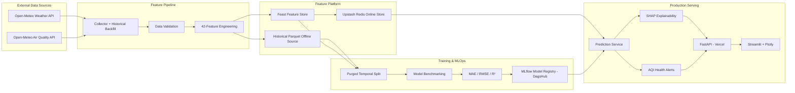
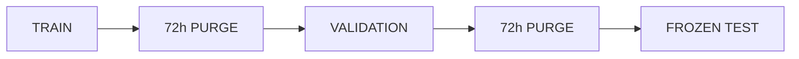

<div align="center">

# 🌍 Pearls AQI Predictor

### Production-Grade, Explainable 3-Day Air Quality Forecasting with Automated MLOps

**Forecasting Lahore's U.S. AQI at +24h, +48h, and +72h using live weather + pollution signals, leakage-safe feature engineering, a Feast feature store, MLflow model registry, automated retraining, FastAPI serving, and a Streamlit intelligence dashboard.**

[](https://github.com/Talha-Techie/Pearls-AQI-Predictor/actions/workflows/tests.yml)
[](https://github.com/Talha-Techie/Pearls-AQI-Predictor/actions/workflows/feature_pipeline.yml)
[](https://github.com/Talha-Techie/Pearls-AQI-Predictor/actions/workflows/training_pipeline.yml)


### 🚀 Live Deployment

[**Open Live Dashboard**](https://pearls-intelligent-aqi-predictor.streamlit.app) ·
[**Open FastAPI Backend**](https://pearls-aqi-predictor-eta.vercel.app) ·
[**Swagger API Docs**](https://pearls-aqi-predictor-eta.vercel.app/docs) ·
[**GitHub Repository**](https://github.com/Talha-Techie/Pearls-AQI-Predictor)

[GitHub Actions](https://github.com/Talha-Techie/Pearls-AQI-Predictor/actions) ·
[Model Metrics](reports/model_benchmarks/final_test_metrics.csv) ·
[EDA](reports/figures)

</div>

---

## Executive Summary

**Pearls AQI Predictor** is a deployed, end-to-end machine learning and MLOps system that predicts **U.S. Air Quality Index (AQI) for the next 24, 48, and 72 hours** for Lahore, Pakistan.

Instead of stopping at model training, the project implements the full production ML lifecycle:

- automated weather and air-quality ingestion from **Open-Meteo**,
- strict validation of schema, ranges, duplicates, missing values, and hourly continuity,
- **42 leakage-safe model features**,
- historical backfilling and direct future targets,
- a **Feast Feature Store** with Redis-backed online serving,
- statistical, classical ML, ensemble, and deep-learning benchmarks,
- leakage-safe **purged temporal validation**,
- model evaluation using **MAE, RMSE, and R²**,
- **MLflow Model Registry** hosted through DagsHub,
- **SHAP** forecast explanations,
- AQI health categories and hazardous-condition alerts,
- a deployed **FastAPI** prediction service,
- a deployed **Streamlit + Plotly** intelligence dashboard,
- hourly feature updates and daily model training with **GitHub Actions**,
- an automated **52-test CI suite**.

> ✅ **Project Status: Production Ready and Deployed End-to-End**

---

# Live Applications

| Service | Status | Public URL |
|---|:---:|---|
| 🌐 Interactive AQI Dashboard | ✅ Live | [Open Streamlit App](https://pearls-intelligent-aqi-predictor.streamlit.app) |
| ⚡ FastAPI Backend | ✅ Live | [Open API](https://pearls-aqi-predictor-eta.vercel.app) |
| 📚 Swagger Documentation | ✅ Live | [Open API Docs](https://pearls-aqi-predictor-eta.vercel.app/docs) |
| ❤️ Backend Health | ✅ Live | [Check Health](https://pearls-aqi-predictor-eta.vercel.app/health) |
| 🧠 Forecast Endpoint | ✅ Live | [Lahore Forecast](https://pearls-aqi-predictor-eta.vercel.app/api/v1/forecast?city=Lahore) |

---

# Why This Project Is Different

Many ML projects stop after reporting a model score. Pearls AQI Predictor treats forecasting as an **operational machine-learning system**.

| Area | Implementation |
|---|---|
| Forecast horizons | Direct +24h, +48h, +72h AQI prediction |
| Data ingestion | Open-Meteo Weather + Air Quality APIs |
| Historical pipeline | Chunked API backfill with retry/backoff |
| Validation | Schema, nulls, duplicates, ranges, continuity |
| Feature engineering | 42 weather, pollution, temporal, lag, rolling, cyclical and trend features |
| Leakage prevention | Shift-before-roll + purged temporal splitting |
| Feature Store | Feast |
| Online store | Upstash Redis |
| Model families | Persistence, OLS, Ridge, Random Forest, Gradient Boosting, PyTorch MLP |
| Evaluation | MAE, RMSE, R² + persistence baseline |
| Registry | DagsHub-hosted MLflow |
| Explainability | SHAP LinearExplainer |
| Alerts | AQI categories, health guidance, hazardous forecast detection |
| Backend | FastAPI on Vercel |
| Frontend | Streamlit Community Cloud |
| Automation | Hourly feature pipeline + daily training |
| Testing | 52 automated tests |
| Deployment | Fully deployed managed/serverless architecture |

---

# System Architecture



---

# Project Requirements Coverage

| Requirement | Status | Implementation |
|---|:---:|---|
| Predict AQI for the next 3 days | ✅ | Direct 24h, 48h and 72h targets |
| Weather + pollutant data collection | ✅ | Open-Meteo APIs |
| Time and derived features | ✅ | Local temporal + cyclical + lag + rolling features |
| AQI change rate | ✅ | `aqi_change_rate_1h` |
| Feature Store | ✅ | Feast |
| Historical backfill | ✅ | Month-chunked resilient backfill |
| Historical feature/target retrieval | ✅ | Feast historical feature retrieval |
| Model training pipeline | ✅ | Benchmark + champion finalization |
| MAE / RMSE / R² | ✅ | Validation + frozen test reports |
| Model Registry | ✅ | MLflow on DagsHub |
| Hourly automation | ✅ | GitHub Actions |
| Daily training automation | ✅ | GitHub Actions |
| Statistical → deep-learning variety | ✅ | OLS through PyTorch MLP |
| Explainability | ✅ | SHAP |
| Hazardous AQI alerting | ✅ | Health categories + alert levels |
| FastAPI inference layer | ✅ | Deployed on Vercel |
| Interactive dashboard | ✅ | Deployed on Streamlit |
| Automated testing | ✅ | 52 tests |
| Public cloud deployment | ✅ | Vercel + Streamlit Community Cloud |

---

# Data

## Target Location

| Setting | Value |
|---|---|
| City | Lahore |
| Latitude | `31.5204` |
| Longitude | `74.3587` |
| Local timezone | `Asia/Karachi` |
| Canonical storage timezone | UTC |
| AQI definition | U.S. AQI |

## Data Sources

- [Open-Meteo Weather API](https://open-meteo.com/)
- [Open-Meteo Air Quality API](https://open-meteo.com/en/docs/air-quality-api)

### Weather Inputs

```text
temperature_2m
relative_humidity_2m
pressure_msl
precipitation
wind_speed_10m
wind_direction_10m
```

### Air-Quality Inputs

```text
us_aqi
pm2_5
pm10
carbon_monoxide
nitrogen_dioxide
sulphur_dioxide
ozone
```

---

# Historical Dataset

The original research and benchmarking dataset covers approximately:

```text
2023-01-01 → 2026-07-29
```

```text
Raw hourly observations:       31,344
Engineered training rows:      31,248
Model features:                    42
Forecast targets:                   3
```

Production daily retraining uses a **rolling one-year window** rather than repeatedly downloading all historical data.

---

# Feature Engineering

The system uses **42 model features** across current weather, pollution, temporal/cyclical signals, lags, rolling statistics, and AQI trends.

## Direct Targets

```text
target_aqi_24h
target_aqi_48h
target_aqi_72h
```

---

# Leakage Prevention

Historical rolling values are computed from prior observations only:

```python
previous_aqi = df["us_aqi"].shift(1)
```

A 72-hour purge protects the longest target horizon across temporal dataset boundaries.



Initial split:

| Partition | Rows |
|---|---:|
| Training | 21,801 |
| Validation | 4,615 |
| Frozen test | 4,688 |

---

# Model Development

```text
Persistence Baseline
        ↓
Statistical OLS
        ↓
Ridge Regression
        ↓
Random Forest
        ↓
Gradient Boosting
        ↓
PyTorch Deep MLP
```

## Advanced Validation Results

| Model | Horizon | MAE | RMSE | R² |
|---|---:|---:|---:|---:|
| **Ridge** | **24h** | **15.364** | **20.543** | **0.779** |
| PyTorch Deep MLP | 24h | 16.221 | 21.111 | 0.766 |
| Statistical OLS | 24h | 16.236 | 21.375 | 0.761 |
| **PyTorch Deep MLP** | **48h** | 21.861 | **27.470** | **0.607** |
| Ridge | 48h | **21.796** | 27.843 | 0.596 |
| **PyTorch Deep MLP** | **72h** | **23.419** | **29.403** | **0.552** |
| Ridge | 72h | 23.936 | 30.336 | 0.524 |

---

# Production Champion

Production uses:

```text
Ridge Regression + StandardScaler
```

Ridge was selected for its strong validation performance, deterministic training, low inference cost, compact artifacts, and straightforward SHAP explainability.

---

# Final Frozen-Test Performance

| Horizon | MAE | RMSE | R² | Persistence RMSE | RMSE Improvement |
|---|---:|---:|---:|---:|---:|
| **24h** | **18.23** | **24.99** | **0.751** | 32.36 | **22.8%** |
| **48h** | **24.76** | **33.37** | **0.537** | 39.14 | **14.8%** |
| **72h** | **26.74** | **35.53** | **0.450** | 41.25 | **13.9%** |

---

# Feast Feature Store

Feature definitions are centralized through **Feast**.

### Feature Service

```text
aqi_prediction_features_v1
```

### Entity

```text
city
```

The online store uses **Upstash Redis** for persistent production serving.

---

# MLflow Model Registry

Production models are registered through **MLflow** on DagsHub:

```text
aqi-ridge-24h
aqi-ridge-48h
aqi-ridge-72h
```

---

# Explainability

Forecasts use **SHAP LinearExplainer** to expose the feature-level contribution behind each prediction horizon.

---

# Health Intelligence

| AQI | Category | Alert Level |
|---:|---|---|
| 0–50 | Good | None |
| 51–100 | Moderate | None |
| 101–150 | Unhealthy for Sensitive Groups | Advisory |
| 151–200 | Unhealthy | Warning |
| 201–300 | Very Unhealthy | High |
| 301+ | Hazardous | Critical |

---

# FastAPI Backend

### 🌐 Production API

**Base URL:**  
https://pearls-aqi-predictor-eta.vercel.app

**Swagger Docs:**  
https://pearls-aqi-predictor-eta.vercel.app/docs

**Health:**  
https://pearls-aqi-predictor-eta.vercel.app/health

**Live Lahore Forecast:**  
https://pearls-aqi-predictor-eta.vercel.app/api/v1/forecast?city=Lahore

## Run Locally

```bash
uvicorn app.main:app --reload
```

## Main Endpoints

| Method | Endpoint | Purpose |
|---|---|---|
| `GET` | `/health` | Service health |
| `GET` | `/api/health` | Deployment health alias |
| `GET` | `/api/v1/forecast?city=Lahore` | Forecast from online Feast features |
| `POST` | `/api/v1/features/refresh` | Refresh latest features |
| `POST` | `/api/v1/forecast/live?city=Lahore` | Refresh + forecast |
| `GET` | `/api/v1/explain/24h?city=Lahore&top_n=5` | SHAP explanation |

---

# Streamlit Intelligence Dashboard

### 🚀 Live Dashboard

**Public Application:**  
https://pearls-intelligent-aqi-predictor.streamlit.app

The deployed dashboard provides:

- current AQI,
- 24h / 48h / 72h forecasts,
- AQI health categories,
- interactive gauge,
- forecast trend chart,
- pollutant monitoring,
- health guidance,
- SHAP feature contributions,
- feature-store/model status,
- manual live refresh.

## Run Locally

```bash
streamlit run app/dashboard/dashboard.py
```

---

# Automation

## Hourly Feature Pipeline

```cron
5 * * * *
```

```text
Open-Meteo
   ↓
Latest history
   ↓
42 inference features
   ↓
Feast
   ↓
Upstash Redis
```

## Daily Training Pipeline

```cron
30 1 * * *
```

```text
Rolling backfill
   ↓
Validation
   ↓
Feature engineering
   ↓
Feast historical retrieval
   ↓
Model benchmark
   ↓
Ridge finalization
   ↓
MLflow/DagsHub registration
```

---

# Continuous Integration

Current automated test suite:

```text
52 passed
```

Run locally:

```bash
pytest -v -p no:cacheprovider
```

---

# Security & Secrets

Credentials are never committed to source control.

```text
REDIS_CONNECTION_STRING
DAGSHUB_USERNAME
DAGSHUB_TOKEN
MLFLOW_TRACKING_URI
MLFLOW_TRACKING_USERNAME
MLFLOW_TRACKING_PASSWORD
AQI_API_BASE_URL
```

---

# Repository Structure

```text
Pearls-AQI-Predictor/
├── .github/workflows/
├── app/
│   ├── analysis/
│   ├── api/
│   ├── config/
│   ├── dashboard/
│   ├── feature_pipeline/
│   ├── prediction/
│   ├── training_pipeline/
│   └── main.py
├── feature_repo/
├── reports/
├── artifacts/
├── tests/
├── .env.example
├── requirements.txt
├── pyproject.toml
├── vercel.json
└── README.md
```

---

# Local Setup

```bash
git clone https://github.com/Talha-Techie/Pearls-AQI-Predictor.git
cd Pearls-AQI-Predictor
python -m venv .venv
pip install -r requirements.txt
```

Configure `.env` with Lahore, Redis, and MLflow settings before running the full pipeline.

---

# Deployment Architecture

| Component | Production Service | Status |
|---|---|:---:|
| CI/CD | GitHub Actions | ✅ |
| Hourly feature pipeline | GitHub Actions | ✅ |
| Daily training pipeline | GitHub Actions | ✅ |
| Online Feature Store | Feast + Upstash Redis | ✅ |
| Model Registry | MLflow + DagsHub | ✅ |
| Backend API | Vercel | ✅ |
| Frontend | Streamlit Community Cloud | ✅ |

---

# Key Results at a Glance

```text
31k+ historical hourly observations
42 engineered model features
3 direct AQI forecast horizons
6 model families explored
52 automated tests
3 registered production models

24h test R² = 0.751
24h RMSE improvement vs persistence = 22.8%

Hourly feature automation: LIVE
Daily training automation: LIVE
Feast online feature serving: LIVE
MLflow model registry: LIVE
FastAPI backend: DEPLOYED
Streamlit dashboard: DEPLOYED
SHAP explanations: ENABLED
AQI health alerts: ENABLED
```

---

# Submission Note

> ✅ **Project Status: Production Ready and Deployed.**

This repository demonstrates the engineering required to make a forecasting model operational:

> **collect → validate → engineer → store → train → evaluate → register → serve → explain → visualize → automate → test → deploy**

---

<div align="center">

### Built for the 10Pearls SHINE AI/ML Internship Project

**Pearls AQI Predictor — From raw environmental signals to explainable, automated, production-ready air-quality intelligence.**

### [🚀 Open Live Dashboard](https://pearls-intelligent-aqi-predictor.streamlit.app)

[Back to top](#-pearls-aqi-predictor)

</div>
